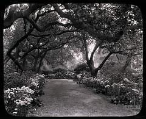

<link rel="stylesheet" href="css/blueimp-gallery.min.css">

<!-- The Gallery as lightbox dialog, should be a child element of the document body -->

    

    <h3 class="title"></h3>
    <a class="prev">‹</a>
    <a class="next">›</a>
    <a class="close">×</a>
    
    <ol class="indicator"></ol>

    
    
    

